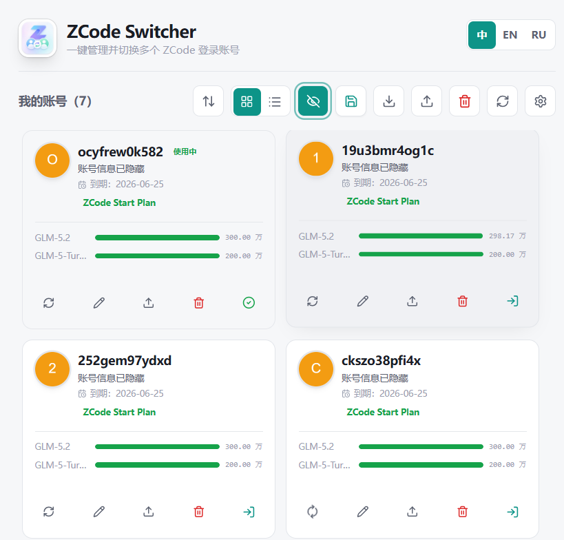
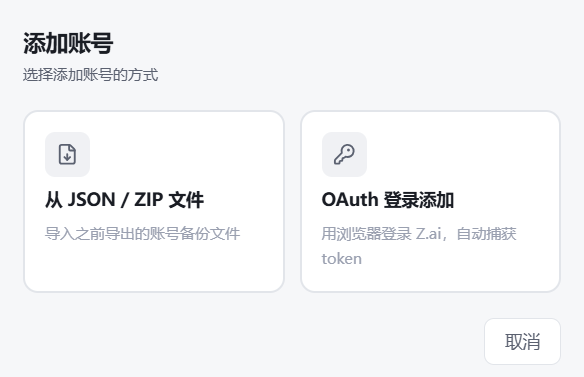
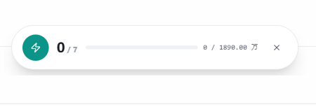

<h1 align="center">ZCode Switcher</h1>

<div align="center">

**简体中文** | [English](README.en.md)

<br />


<p><strong>ZCode 账号管理与无感切换桌面工具</strong></p>
<p>本地账号库 · 额度显示 · 自动切换 · 胶囊悬浮窗 · 应用内更新</p>

[](https://github.com/git-l-1031/zcode-switcher/releases)
[](https://github.com/git-l-1031/zcode-switcher/releases)
[](https://github.com/git-l-1031/zcode-switcher/commits/main)
[](https://github.com/git-l-1031/zcode-switcher/releases)
[](https://tauri.app/)
[](https://react.dev/)

[下载最新版](https://github.com/git-l-1031/zcode-switcher/releases) · [使用说明](docs/usage.md) · [更新日志](docs/changelog.md)

</div>

---

## 简介

ZCode Switcher 用于本地保存和管理多个 ZCode 账号，支持额度显示、无感切换账号无需重启，以及 GLM-5.2 低额度自动切换。

所有账号档案保存在本机，不上传到第三方服务器。

## 功能

| 功能 | 说明 |
| --- | --- |
| 本地账号管理 | 保存、重命名、删除、批量删除多个账号 |
| JSON 导入导出 | 方便备份、迁移账号档案 |
| 无感切换 | 无需重启 ZCode，切换账号后即时同步配置 |
| 额度显示 | 显示额度、订阅状态和刷新结果 |
| GLM-5.2 自动切换 | 额度低于阈值时，自动切到剩余额度更高的账号 |
| 胶囊悬浮窗 | 显示 GLM-5.2 账号池统计，并支持调整大小 |
| 定时刷新 | 支持按分钟自动刷新额度，关闭后保留最近额度信息 |
| 多语言界面 | 支持中文、英文、俄文 |
| 应用内更新 | 检测新版、显示更新内容、下载并安装 |

## 下载

请到 [Releases](https://github.com/git-l-1031/zcode-switcher/releases) 下载最新版 Windows 安装包。

安装包名称通常类似：

```text
ZCode.Switcher_x.x.x_x64-setup.exe
```

## 使用流程

1. 先在 ZCode 中正常登录一个账号。
2. 打开 ZCode Switcher，点击“保存当前账号”，把当前登录态保存到本地账号库。
3. 如需添加更多账号，可以先在 ZCode 中切换登录，也可以在工具中使用 OAuth 登录添加或导入 JSON / ZIP 备份文件。
4. 账号保存后，会在列表中显示昵称、订阅到期时间、额度进度条和刷新状态。
5. 开启“无感切换”后，点击账号卡片的切换按钮即可切换账号。切换过程无需重启 ZCode，账号配置会即时生效。
6. 如果使用 GLM-5.2，可开启低额度自动切换。当当前账号额度低于阈值时，软件会自动切到剩余额度更高的账号。
7. 如需常驻查看账号池状态，可开启胶囊悬浮窗模式，把额度统计放在桌面角落。

## 截图

### 主界面

<p align="center">
  
</p>

### 添加账号

<p align="center">
  
</p>

### 无感切换

无需重启 ZCode，切号后配置即时生效。

<p align="center">
  
</p>

### 胶囊悬浮窗

<p align="center">
  
</p>

## 文档

- [使用说明](docs/usage.md)
- [更新日志](docs/changelog.md)
- [开发说明](docs/development.md)
- [发布说明](docs/release.md)

## 提示

导出的 JSON 和本地账号档案包含敏感信息，请妥善保存，不要上传到公开位置。

## 免责声明

本工具是第三方辅助工具，与 ZCode / Z.ai 官方无关。请遵守相关平台规则，并自行承担账号使用风险。
